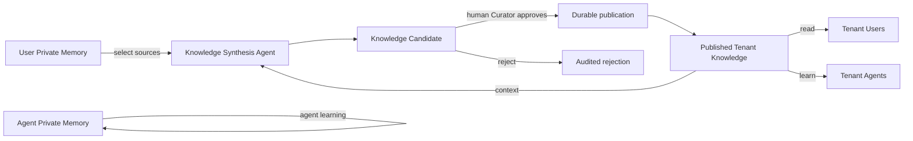
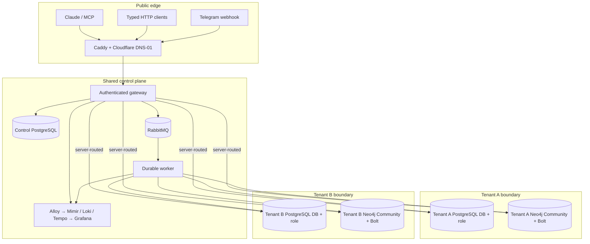
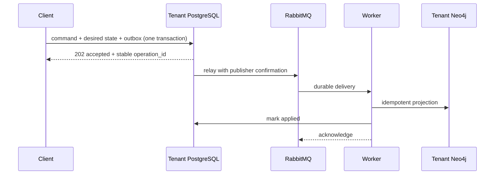

<div align="center">
  
  <h1>CoEngram</h1>
  <p><strong>Sovereign memory for teams and AI agents.</strong></p>
  <p>Private by default. Shared by review. Owned by you.</p>

  [](https://github.com/0xiDen/coengram/actions/workflows/ci.yml)
  [](https://github.com/0xiDen/coengram/actions/workflows/release.yml)
  [](LICENSE)
  [](pyproject.toml)
  [](https://neo4j.com/)
</div>

CoEngram is an open-source, self-hosted memory control plane for human users, Claude
instances, and autonomous agents. It keeps private experience private, turns selected
experience into reviewed team knowledge, and gives every request a server-verified
Tenant context.

The stack combines Neo4j Agent Memory over private Bolt connections, Neo4j Community,
PostgreSQL, RabbitMQ, ActiveGraph, LangChain, authenticated streamable HTTP MCP, Caddy,
and the Grafana observability suite—all deployable with Docker Compose.

> [!IMPORTANT]
> CoEngram is an iteration-1 alpha: Community-only, single-server, and intentionally
> not a high-availability system. Its isolation and recovery gates are tested, but
> operators should complete their own threat model and restore drill before production.

## Why CoEngram?

Agent memory becomes dangerous when identity, privacy, execution history, and shared
knowledge collapse into one undifferentiated graph. CoEngram gives each concern a
specific boundary:

| Concern | CoEngram contract |
| --- | --- |
| Identity | Opaque, revocable credentials bind one Principal to one Tenant Membership |
| User memory | Only the User—or an explicitly delegated Agent—can recall it |
| Agent memory | Autonomous Agents have a private scope of their own |
| Team knowledge | Users and Agents read it only after human review and publication |
| Execution | ActiveGraph events remain separate from ordinary memory recall |
| Storage | One Neo4j Community instance and one PostgreSQL database/role per Tenant |
| Portability | Versioned, checksummed JSON Lines import/export without credentials |
| Operations | Durable outbox delivery, recovery gates, metrics, logs, traces, and audits |

## The memory model



Promotion never changes the visibility of its private source. Reviewers see the
distilled claim and privacy-safe provenance—not the original private content. An Agent
may propose knowledge, but it cannot approve its own proposal. Private-memory erasure
also requires a distinct human approval in iteration 1.

## What ships today

- Opaque `mem1` Bearer tokens with Principal, Membership, role, Delegation, Subject
  User, expiry, one-time issuance, rotation, and immediate revocation semantics.
- User-owned and Agent-owned Private Memory plus reviewed Tenant Knowledge.
- Server-derived routing: callers cannot choose a Tenant, database, graph, owner, or
  Subject User through HTTP bodies, MCP arguments, Telegram text, or forwarded headers.
- Private retain, recall, inspection, superseding correction, approved erasure, and
  independently checksummed archive import/export.
- Human-reviewed knowledge proposal, approval/rejection, idempotent publication, and
  privacy-safe audit history.
- A typed `knowledge_synthesis` ActiveGraph Pack using LangChain's Anthropic adapter,
  replayable events, budgets, cancellation, and deterministic recorded-provider tests.
- Claude-compatible streamable HTTP MCP and a typed FastAPI surface for ActiveGraph,
  LangChain, services, CLIs, schedulers, and future interfaces.
- A Telegram direct-message adapter with operator-managed numeric Channel Bindings,
  explicit memory commands, and asynchronous synthesis invocation; free-form chat
  never selects identity or Tenant.
- PostgreSQL transactional outbox, durable RabbitMQ delivery, publisher confirmation,
  idempotent Neo4j projection, dead-letter inspection, and exact-event redrive.
- Custom Caddy built with the Cloudflare DNS plugin. The public hostname and API token
  are both loaded from protected files; the Caddyfile contains no deployment domain.
- Central Alloy, Mimir, Loki, Tempo, and Grafana telemetry with content-safe labels.
- Declarative Tenant provisioning, Alembic/Neo4j migrations, encrypted backups,
  isolated restore drills, recovery-gated upgrades, and two-operator decommissioning.

## Architecture



Caddy exposes only `/mcp`, `/api/v1/*`, and the exact OAuth protected-resource metadata
path. PostgreSQL, RabbitMQ, Grafana, and every Tenant's Bolt endpoint remain private or
loopback-only. The gateway strips inbound identity-like headers before authentication
and resolves storage only from the Access Token's Tenant Session.

Read the deeper [architecture guide](docs/architecture.md) and the recorded
[architecture decisions](docs/adr/).

## Local quick start

Requirements:

- Docker Engine or Docker Desktop with Compose v2
- Python 3.12 for host-side development and verification
- Enough disk for Neo4j, PostgreSQL, RabbitMQ, observability stores, CPU PyTorch, and
  the image-baked `BAAI/bge-small-en-v1.5` embedding model

```sh
git clone https://github.com/0xiDen/coengram.git
cd coengram
make setup
make config
make up
docker compose ps
```

The first build is intentionally substantial: embeddings run locally from a pinned
model revision baked into the immutable image, including on isolated restore networks.
Development services bind only to `127.0.0.1`:

| Service | Local address |
| --- | --- |
| Gateway / MCP / OpenAPI | `http://127.0.0.1:8080` |
| Neo4j Browser | `http://127.0.0.1:7474` |
| Neo4j Bolt | `bolt://127.0.0.1:7687` |
| Grafana | `http://127.0.0.1:3000` |

The one-shot seed service creates `tenant-a` and prints a development Access Token:

```sh
docker compose logs seed-control
export MEMORY_MCP_TOKEN='mem1...'
```

Retain and recall a first memory:

```sh
curl -fsS http://127.0.0.1:8080/api/v1/memories \
  -H "Authorization: Bearer $MEMORY_MCP_TOKEN" \
  -H 'Content-Type: application/json' \
  -d '{
    "content": "Production migrations require a current recovery point.",
    "kind": "explicit",
    "confidence": 1.0,
    "idempotency_key": "quickstart-retain-1"
  }'

curl -fsS http://127.0.0.1:8080/api/v1/memories/recall \
  -H "Authorization: Bearer $MEMORY_MCP_TOKEN" \
  -H 'Content-Type: application/json' \
  -d '{"query":"production migration recovery","limit":10}'
```

`make down` stops the stack without deleting memory. Volume deletion is deliberately
not wrapped in a Make target.

## Connect Claude over MCP

Copy [`.mcp.json.example`](.mcp.json.example) into the Claude client project, replace
the example URL with the deployed MCP URL, and inject the token through the client
environment:

```sh
export MEMORY_MCP_TOKEN='mem1...'
```

The public MCP tools are intentionally intent-oriented:

- `memory_recall`, `memory_inspect_private`, `memory_retain`, `memory_correct`
- `memory_request_erasure`
- `knowledge_propose`, `knowledge_review`
- `knowledge_synthesize`, `agent_run_status`, `agent_run_cancel`

Raw Cypher, Bolt credentials, upstream Neo4j Agent Memory MCP tools, Tenant selectors,
and owner selectors are not exposed.

## Typed HTTP and agent integrations

Every application route is versioned under `/api/v1` and authenticated with
`Authorization: Bearer <opaque-token>`. FastAPI provides OpenAPI inside the trusted
application network. Core resources include:

- `/memories`, `/memories/recall`, and correction subresources
- `/knowledge/candidates` and human review subresources
- `/erasure-requests` and human review subresources
- `/memory-archives/private` and `/memory-archives/tenant`
- `/agent-runs` with start, status, and cooperative cancellation
- `/api/v1/telegram/webhook` with Telegram's secret header

Agent invocation is capability-based rather than endpoint-per-agent:

```json
{
  "capability": "knowledge_synthesis",
  "input": {
    "request": "Distill the selected deployment lesson",
    "source_memory_ids": ["memory-id"]
  },
  "idempotency_key": "stable-client-key"
}
```

The gateway persists and queues the run. The worker executes the registered ActiveGraph
Pack with typed inputs, model settings, event history, budgets, and provenance. This
same invocation seam is designed for LangChain agents, ActiveGraph Packs, humans,
scheduled jobs, CLIs, and messaging adapters.

Telegram exposes that seam explicitly with
`/synthesize <memory-id>[,<memory-id>] | <request>`. It returns the durable Agent Run
identifier immediately; `/status <run-id>` and `/cancel <run-id>` remain separate.
The persisted reply context contains only the channel and numeric chat destination so
a delivery worker can route an eventual outcome without coupling Telegram details to
the Agent Runtime or storing message content as routing metadata.

## Consistency you can reason about

Private-memory mutations and knowledge publication cross PostgreSQL, RabbitMQ, and
Neo4j without pretending those systems share one transaction:



`accepted` means PostgreSQL committed the authoritative desired state. `applied` means
the graph projection completed. Recall never reports a dependency outage as an empty
result, and redelivery is safe even after a worker crash between graph mutation and
message acknowledgement.

## Production deployment

Production uses two Compose layers:

- [`deploy/shared.compose.yaml`](deploy/shared.compose.yaml) for Caddy, gateway, worker,
  shared PostgreSQL/RabbitMQ, and observability.
- [`deploy/tenant.compose.yaml`](deploy/tenant.compose.yaml) for one isolated Neo4j
  Community project and volumes per immutable Tenant ID.

Tagged releases publish the application image as
`ghcr.io/0xiden/coengram:<tag>`. Resolve the selected tag to its published `sha256`
digest, copy the environment examples to operator-owned paths, point
`MEMORY_PLATFORM_IMAGE` at that immutable digest, and create the files documented
in [`deploy/secrets/README.md`](deploy/secrets/README.md).

The deployment hostname is a secret input named `memory_public_host`. Caddy's
entrypoint reads it from `/run/secrets/memory_public_host`, validates it, exports it only
to the Caddy process, and substitutes it into a domain-free Caddyfile. Caddy's admin
API is disabled; Prometheus metrics use a separate internal-only listener. Per-host
metrics are disabled and host/SNI fields are removed from Caddy telemetry before
collection. The Cloudflare API token is independently file-backed. DNS record creation,
Cloudflare proxy settings, server firewalling, SSH provisioning, and remote backup
storage remain outside this repository.

Follow the complete [production runbook](deploy/README.md), including credential
rotation, migration recovery gates, encrypted backups, restore drills, and Tenant
retirement.

## Operate with `coengramctl`

The operator CLI manages:

- declarative Tenant plan/apply and active-schema migrations
- Principals, Memberships, roles, Delegations, and Telegram Channel Bindings
- one-time token issuance, revocation, and overlap-bounded rotation
- encrypted backup creation, verification, retention, and isolated restore drills
- exact dead-letter redrive and two-operator Tenant decommissioning

```sh
coengramctl tenant plan --manifest /protected/manifests/product-a.json
coengramctl tenant apply --manifest /protected/manifests/product-a.json \
  --confirm tenant-product-a-backend

coengramctl token issue \
  --tenant-id tenant-product-a-backend \
  --principal-id user-alice
```

Tokens are displayed once. CoEngram stores only non-reversible verifiers, and disabling
a Principal, Membership, Delegation, role, or Channel Binding invalidates dependent
credentials on the next request.

## Observability without memory leakage

Alloy centralizes content-safe JSON logs, Prometheus metrics, and OTLP traces into Loki,
Mimir, and Tempo; Grafana is provisioned with datasources and dashboards. PostgreSQL and
Neo4j stdout stay out of Loki because diagnostics can include stored values; their
exporter/probe signals remain centralized. Telemetry excludes Access Tokens,
credentials, prompts, memory/candidate content, model input/output, and Telegram text.
Tenant, token, run, request, and message labels use namespaced HMAC references derived
from one protected shared key file; raw identifiers and the key never enter telemetry
or process environment values.

Iteration 1 records workload and unused-token signals as informative logs and metrics.
It does not enforce quotas or return `429` responses while real usage patterns are
unknown.

## Verify everything

Install the development dependencies and run the same provider-neutral release gate
used by CI:

```sh
python3.12 -m venv .venv
. .venv/bin/activate
python -m pip install -e '.[dev]'
make verify
make package
```

`make verify` covers formatting, lint, strict mypy, unit and contract tests, Compose
validation, the real custom Caddy image, and ephemeral PostgreSQL/RabbitMQ/Neo4j
integration tests. The release tracer proves User isolation, Agent delegation, reviewed
Tenant publication, same-Tenant Agent learning, cross-Tenant denial, fault recovery,
and content-safe telemetry.

## Release automation

- [`ci.yml`](.github/workflows/ci.yml) is reusable with `workflow_call` and runs the
  complete verification gate plus package validation.
- [`release.yml`](.github/workflows/release.yml) accepts semantic-version tags,
  verifies the tag matches `pyproject.toml`, rebuilds from source, publishes a
  multi-architecture GHCR image, attests artifacts, publishes to PyPI through trusted
  publishing, and creates the GitHub Release.
- All third-party Actions are pinned to immutable commit SHAs; Dependabot tracks their
  updates.

PyPI publication requires a `pypi` GitHub Environment and a trusted publisher (or
first-release pending publisher) for the `coengram` project. No long-lived PyPI token
is used.

## Project map

| Path | Purpose |
| --- | --- |
| `src/agent_memory_service/` | Deep modules, adapters, workers, stores, and agent runtime |
| `migrations/` | Control and per-Tenant PostgreSQL migrations |
| `deploy/` | Production Compose, Caddy, database/broker setup, secrets, and systemd units |
| `ops/observability/` | Alloy, Mimir, Loki, Tempo, Grafana configuration and dashboards |
| `docs/architecture.md` | Security boundaries, consistency model, execution, and topology |
| `docs/adr/` | Architecture decision records |
| `docs/runbooks/` | Backup, restoration, rotation, migration, and decommission procedures |
| `.scratch/coengram/PRD.md` | Iteration-1 product requirements and acceptance decisions |

## Roadmap

- OIDC/SSO while preserving the same server-derived Tenant Session
- additional ActiveGraph capability Packs behind the typed invocation seam
- more messaging and human interfaces using operator-bound identities
- deployment profiles beyond the iteration-1 single-server Community topology

## Contributing and security

Read [CONTRIBUTING.md](CONTRIBUTING.md) before opening a change. Please report security
issues through the private process in [SECURITY.md](SECURITY.md), not a public issue.

## License

CoEngram is released under the [MIT License](LICENSE). Attribution for the image-baked
embedding model is preserved in [THIRD_PARTY_NOTICES.md](THIRD_PARTY_NOTICES.md).
