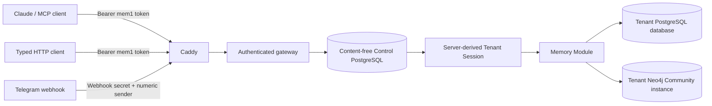
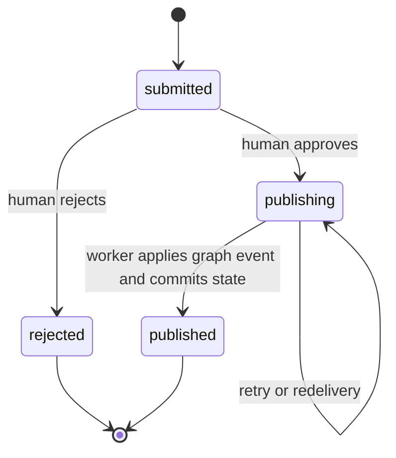

# CoEngram architecture

## Security and tenancy boundary

Every request begins with an opaque `mem1` Access Token. The gateway stores only its
SHA-256 verifier and derives the Tenant, Actor, roles, and optional Delegation from the
Control Store. Request bodies, MCP arguments, Telegram text, and forwarded headers
cannot select a Tenant, Principal, database, graph, or Subject User.

Neo4j Community has one standard database per instance, so every Tenant receives a
separate Neo4j container, credential, and volume. PostgreSQL is shared at the server
level but uses a separate database and role per Tenant. A missing, unhealthy, or
changed route fails closed; no default Tenant exists in production routing.

This is a hard application-level routing and data boundary, not a claim that every
shared infrastructure process is mutually untrusted. Gateway and worker are trusted
across the deployment and mount the credentials needed to route to every Tenant store;
their compromise can cross Tenant boundaries. Tenant database roles and graph
instances contain normal request failures and operator mistakes, while the host,
shared application image, and its runtime dependencies remain deployment-wide trust
anchors.

Private Memory belongs to a Principal. A User sees their own Private Memory and
published Tenant Knowledge. An autonomous Agent sees its own Private Memory and Tenant
Knowledge. A delegated Agent additionally sees exactly one token-bound Subject User's
Private Memory; writes on the User's behalf retain the Agent as provenance Actor.

## Deep Memory Module

HTTP, MCP, Telegram, the operator CLI, and Agent capabilities adapt into one Memory
Module. It owns authorization, scope selection, provenance, corrections, reviewed
promotion, approved erasure, and archives. Neo4j Agent Memory is an internal Bolt
adapter; upstream MCP tools, raw Cypher, and Bolt credentials are never public.

Telegram's explicit `/synthesize` command adapts into the same channel-neutral Agent
Invocation used by HTTP. The invocation snapshot persists only `channel=telegram` and
the numeric chat destination as reply context. Starting returns a durable Agent Run
identifier; status, cancellation, and later channel delivery stay outside Pack logic.

| System | Authoritative responsibility |
| --- | --- |
| Control PostgreSQL | Tenants, Principals, Memberships, Delegations, token verifiers, Channel Bindings, routing, lifecycle state |
| Tenant PostgreSQL | Authoritative private-memory commands/desired state, governance, reviews, audit, erasure, fenced Agent Run snapshots/leases, transactional outbox |
| RabbitMQ | Durable notification delivery from committed outbox events |
| Tenant Neo4j | Idempotent recall projection of Private Memory and fully published Tenant Knowledge |
| ActiveGraph | Native durable Agent execution projection used by Packs and replay, reconciled from the fenced snapshot |
| LangChain | Model-provider adaptation; no durable workflow ownership |

## Reviewed knowledge consistency

Knowledge is never copied directly from a private scope into shared recall. A Principal
submits a distilled candidate with safe source references, duplicate/conflict findings,
and confidence. A human Curator reviews the claim without receiving source content.

Private retain, correction, archive import, and approved erasure first commit an
authoritative command, desired state, audit record, and outbox event atomically in the
exact Tenant database. Knowledge approval uses the same transactional outbox boundary.
The HTTP and MCP mutation contract returns a versioned receipt with a stable operation
identifier and `accepted`/`applied` state; it does not equate PostgreSQL acceptance with
Neo4j visibility. Personal inspection reads the authoritative desired-state ledger and
therefore exposes pending erasure and content-free erased state even after graph removal.
The relay publishes durable RabbitMQ messages with publisher confirmation. A worker
loads the exact committed aggregate, applies it idempotently to the routed graph, marks
it applied in PostgreSQL, and only then acknowledges delivery. Redelivery after a
worker crash is safe, including the interval after graph erasure but before PostgreSQL
completion. Recall includes shared knowledge only after `published`; a graph outage is
reported as unavailable rather than an empty result.

Corrections create a new item that supersedes the old one. Erasure is a separate
request/review/execution state machine: a User cannot directly forget a memory in
iteration 1, and the requester cannot approve their own removal. Completed removal
keeps only a content-free audit tombstone; completion atomically nulls the free-text
request reason and both copies of the review rationale.

Memory Archives use format version 2 JSON Lines. Each typed record carries its own
SHA-256 checksum and the footer checks the complete manifest-plus-record stream. The
decoder validates every checksum, record schema, scope, stable identifier, correction
graph, and tombstone before an import begins. Private archives preserve superseded
correction chains and completed-erasure tombstones. Tenant archives contain only
published Tenant Knowledge and privacy-safe governance views, and imported shared
items enter governance as submitted candidates rather than bypassing review.

## Agent execution

The gateway queues a typed `knowledge_synthesis` invocation in the Tenant Operations
Store. The worker loads the versioned ActiveGraph Pack, the exact `claude-sonnet-5`
LangChain adapter, and the default budget: three model calls, ten tool calls, one
hundred events, two minutes, and USD 0.25. Every lifecycle, model, tool, budget, and
failure transition first passes the fenced Tenant snapshot write, then appends
idempotently to the native ActiveGraph event stream. A retry repairs any missing event
suffix from that durable snapshot before status or replay rebuilds from the stream.
The snapshot is the write-ahead authority for accepted transitions and worker leases;
ActiveGraph remains the native execution and replay projection. A non-prefix divergence
fails closed instead of choosing one history silently.
Runs are addressable, replayable, and cooperatively
cancellable across gateway and worker processes. Idempotency and observation bind the
complete originating context: Tenant, Actor, and—when delegated—Subject User plus
Delegation. Workers acquire one bounded, monotonically fenced PostgreSQL lease before
execution; an expired lease is recoverable, while a stale worker cannot persist over
the newer owner.

The synthesis capability reads only explicitly selected visible Private Memory, reads
published Tenant Knowledge, records duplicate/conflict identifiers, and submits a
candidate. It has no approval capability. Tests use a deterministic recorded provider;
production inference uses an operator-supplied Anthropic secret while embeddings stay
self-hosted. A live synthesis call sends the explicitly selected Private Memory and
Tenant Knowledge in the model prompt to Anthropic, outside the self-hosted memory
boundary. Operators must assess their provider account's region, retention, and
data-use controls or keep live model execution disabled.

## Deployment topology

The local Compose model runs one complete development Tenant. Production uses one
shared Compose project for Caddy, gateway, worker, PostgreSQL, RabbitMQ, Alloy, Mimir,
Loki, Tempo, and Grafana, plus one parameterized Compose project for each Neo4j Tenant.
Only Caddy publishes public host ports. Caddy is built with the Cloudflare DNS module,
obtains certificates for the hostname supplied through a protected secret file,
removes identity-like inbound headers, and proxies only the exact OAuth
protected-resource metadata path, `/mcp`, and `/api/v1/*` to the gateway.

This iteration is intentionally single-server and Community-only. DNS record and
Cloudflare proxy management, firewalling, host disk encryption, SSH provisioning, and
remote backup-storage creation remain operator-owned prerequisites outside the repo.

Alloy centralizes content-safe container logs, Prometheus metrics, and OTLP telemetry
into Loki, Mimir, and Tempo. PostgreSQL and Neo4j stdout are excluded because their
diagnostics may contain stored values; their metrics and health probes remain central.
The application strips all request-derived span data at the exporter boundary and uses
namespaced HMAC identifiers derived by gateway, worker, and host operators from one
protected shared key file. Telemetry excludes hostnames, URLs and queries, request
headers and bodies, tokens, credentials, prompts, memory/candidate content, model
input/output, and Telegram text.
The application exports authentication outcome/latency, route and dependency health,
Agent budget/outcome, outbox lag, worker and Telegram outcomes, and aggregate unused
token signals. A dedicated `pg_monitor` exporter reports PostgreSQL health. Because
Neo4j native metrics are Enterprise-only, Alloy performs a per-Tenant Bolt TCP probe
using only each server-derived opaque Tenant reference; RabbitMQ metrics provide queue
and dead-letter depth. Shadow quotas emit informational metrics only; iteration 1
never returns `429`.
